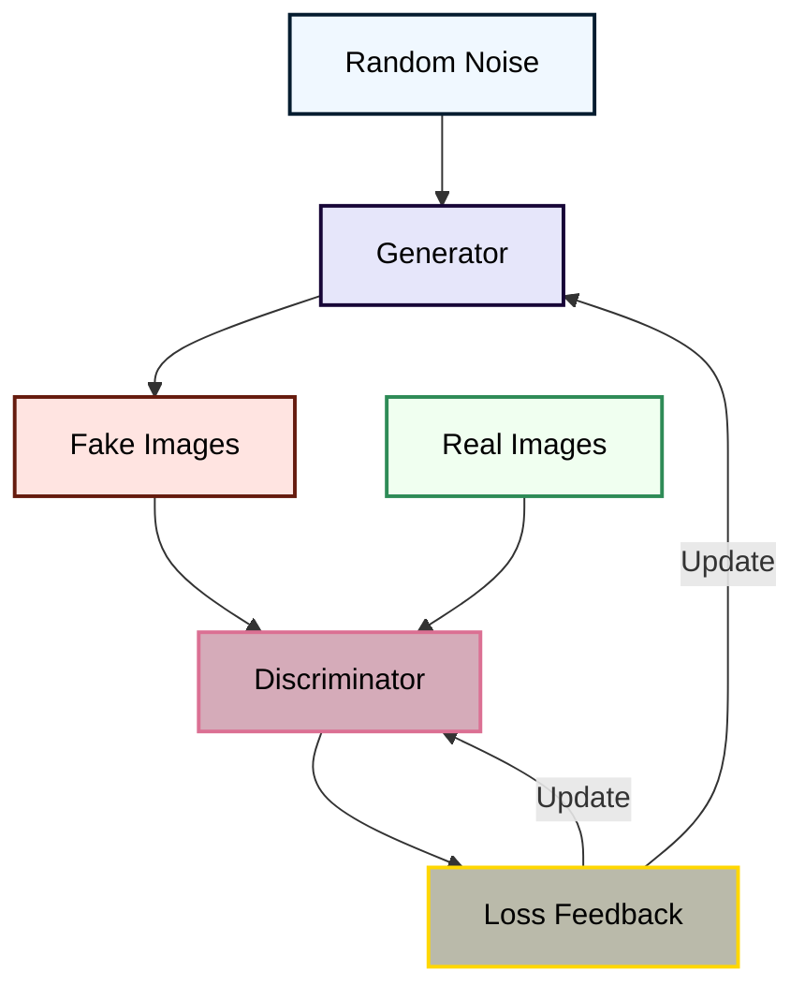

<div align="center">
  <h1 style="font-size: 3.5rem; font-weight: 900; background: linear-gradient(90deg, #051C2F, #DB7093); -webkit-background-clip: text; color: transparent; margin-bottom: 1rem; font-family: 'Segoe UI', sans-serif;">
    MEDICAL IMAGE SYNTHESIS WITH GANS  DCGAN / STYLEGAN
  </h1>
  <div style="max-width: 600px; margin: 0 auto 2rem; padding: 0 1rem;">
    <p style="font-size: 1.1rem; color: #555; line-height: 1.6;">
      Advanced DCGAN architecture enhanced with StyleGAN techniques for generating 
      high-fidelity medical images from DICOM datasets
    </p>
  </div>

  <div style="display: flex; justify-content: center; gap: 1.5rem; margin: 2rem 0;">
    
    
    
    
  </div>
</div>

<div align="center">
  
</div>

> Light GAN-based pipeline to create high-resolution and anatomically rich CT medical images with DCGAN and StyleGAN3.
## Key Features
<div style="display: grid; grid-template-columns: repeat(auto-fit, minmax(300px, 1fr)); gap: 1.5rem; margin: 2rem 0;">
  <div style="background: #F8F9FA; padding: 1.5rem; border-radius: 8px; box-shadow: 0 2px 8px rgba(0,0,0,0.05);">
    <h3 style="color: #051C2F; margin-top: 0;">Medical-Grade Synthesis</h3>
    <p>Generate DICOM-compatible synthetic images with anatomical accuracy</p>
  </div>
  <div style="background: #F8F9FA; padding: 1.5rem; border-radius: 8px; box-shadow: 0 2px 8px rgba(0,0,0,0.05);">
    <h3 style="color: #051C2F; margin-top: 0;">Hybrid Architecture</h3>
    <p>DCGAN stability combined with StyleGAN's visual quality</p>
  </div>
  <div style="background: #F8F9FA; padding: 1.5rem; border-radius: 8px; box-shadow: 0 2px 8px rgba(0,0,0,0.05);">
    <h3 style="color: #051C2F; margin-top: 0;">Clinical Validation</h3>
    <p>Quantitative metrics (FID, SSIM) for medical relevance</p>
  </div>
</div>
</div>

#  Table of Contents

- [What is a GAN?](#what-is-a-gan)
- [Project Description](#project-description)
- [Technologies Used](#technologies-used)
- [Dataset Details](#dataset-name-and-provider)
- [Sample Results](#sample-results)
- [Authors](#authors)
- [Future Improvements](#future-improvements)

#  Medical Image Synthesis with GANs
The project entails employing **Generative Adversarial Networks (GANs)**—an ambitious class of deep learning models—to create realistic medical images. The method is used in the **DCGAN (Deep Convolutional GAN)** model with inspiration from **StyleGAN** for extra visual realism and diversity.


## What is a GAN?

A **Generative Adversarial Network (GAN)** is a machine learning algorithm that consists of two neural networks: a Generative Network and a Discriminator Network.

- **Generator**: Produces synthetic data (e.g., images) from noise.
- **Discriminator**: Learns to identify whether data is real or synthetic data.
Both models are trained jointly within a framework of a game where the generator attempts to deceive the discriminator, and the discriminator attempts to detect counterfeit data.


## Project Description
### 1. Dataset Preparation

Medical images in **DICOM format**, the standard for medical imaging data, were utilized. Images were also translated to standard **JPG format** using open-source platform **3D Slicer**. Transformation code exists in `tojpg.ipynb` notebook.
### 2. Model Implementation

GAN implementation is demonstrated in Jupyter notebook `dcgan-img-medical.ipynb`, including:
- Generator and Discriminator architecture
- Data loading and preprocessing
- Long-term loop of optimization training
- Output visualization
### 3. StyleGAN Influence

We utilized styleGAN-based techniques for enhancing greater diversity and quality of output images. Latent vectors' style mixing and manipulation were accomplished through experiments in modification.
### 4. Integration with GitHub

We started the project from an open-source GAN repository on GitHub. The model and training environment were both modified to make them independently executable using medical images and DICOM conversion support.

---

- `dcgan-img-medical.ipynb` – Full GAN code (generator, discriminator, training)
- `tojpg.ipynb` – Python script to convert JPG images from DICOM using slicer
- `outputs/` – Where images should be output after each epoch
- `imagme_medical.zip/` – JPG image storage directory created from DICOM for training
- `stylgan.ipynb/` _ StyleGAN3 model
- `costum-dataset.ipynb/` _ Medical Image Dataset Loader and Visualizer for Deep Learning (PyTorch)
---
## Technologies Used

| Tool / Library    | Purpose                             |
|-------------------|-------------------------------------|
| Python 3.x        | Programming language                |
| PyTorch / TensorFlow | Deep learning frameworks         |
| NumPy             | Numerical computation               |
| Matplotlib        | Visualization                       |
| fastai            | Training simplification             |
| 3D Slicer         | DICOM image conversion              |
---


 **[GitHub Project Page](https://github.com/Siamsell/medical-image-gan)**
---
## Performance Metrics

| Metric       | DCGAN       | StyleGAN3    |
|--------------|-------------|--------------|
| FID Score    | 64.2        | 24.7         |
| SSIM         | 0.69        | 0.83         |
| Epochs       | 1000        | 100kimg      |

## Dataset Name and Provider
- Dataset Name: Pancreas-CT
- Provider: The Cancer Imaging Archive (TCIA)
- URL for Access:
[dicom dataset](https://www.cancerimagingarchive.net/collection/pancreas-ct/)**
## Reading DICOM files:
DICOM files within each patient directory were searched and read recursively using the
pydicom library.
Slicing sorting:
Slices were sorted based on their Z-axis position (ImagePositionPatient[2]) to maintain
anatomical order. Volume standardization: Limited each volume to a maximum of 128
slices for intra-sample homogeneity. Normalization and resizing: Normalized all 2D slices
to pixel intensity range [0, 255] and resized to a default resolution of 256×256 pixels using
PIL library.
## Format conversion:
Converted preprocessed slices to individual JPEG (.jpg) images instead of the original
DICOM format to easily input into 2D convolutional networks.
Archiving:
Finally, the complete output directory containing the JPEG images was archived into a
ZIP file for easy storage and retrieval. Upon completion of creating the ZIP archive, the
file was stored on the local system. An attempt to drop empty slices, the final filtering
step was carried out to improve further the quality of the dataset.
Zero-filled slice is a fully black 2D image (approximately equal pixel intensity
to zero) with no useful anatomical information. These are typically at the beginning
and end of CT volumes where no patient tissue is represented. Low pixel intensity slices
were removed from the data to ensure that the model trains on only useful anatomical
information.
After the removal of all such blank slices, the cleaned collection of JPEG images were
then uploaded to Kaggle again as a cleaned curated dataset. Subsequent to this cleaned
and curated dataset, a Deep Convolutional Generational Adversarial Network (DCGAN)
was also trained for the generation of realistic fake abdominal CT slices.
## How It Works

1. Convert raw DICOM to JPG slices using `pydicom`
2. Preprocess slices to 256×256 grayscale images
3. Train DCGAN and StyleGAN3 separately
4. Monitor training losses + visual outputs
5. Evaluate image quality with FID/SSIM
6. Output synthetic images for medical education or augmentation

## Sample Results
### DCGAN-Inspired Output (300 epoch with size 64)


### StyleGAN-Inspired Output (100kimg)256*256


### DCGAN-Inspired Output (1000 epoch with size 256)


### Training Losses DCGAN


---

## Authors
# SS | Sellami Siham
# BF | bedj bedj Fatma Zohra
# IS | Ikram Saidani
## Future Improvements

- Use high-end **StyleGAN2/3** modules
- Ranked by metrics such as **FID** or **IS**
- Use a **web-based interactive generator**
- Train on **larger and labeled datasets**
- ## Quick Start

```bash
git clone https://github.com/Siamsell/medicale_IMG-with-deepLearning_model-gan.git
cd medicale_IMG-with-deepLearning_model-gan
pip install -r requirements.txt
jupyter notebook dcgan-img-medical.ipynb
